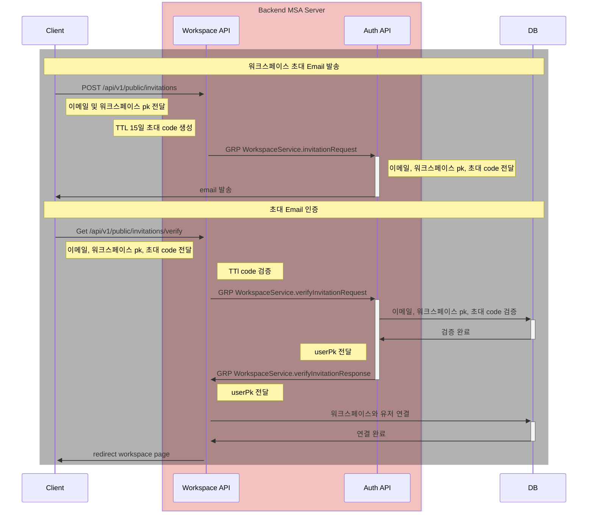

# 워크스페이스 초대 프로세스

```mermaid
sequenceDiagram
    participant Frontend as Client
    box rgba(255, 0, 0, 0.2) Backend MSA Server
        participant WorkspaceAPI as Workspace API
        participant AuthAPI as Auth API
    end
    participant DB as DB
%% 1. 파일 업로드 준비
    rect rgb(0, 0, 0, 0.3)
        Note over Frontend, DB: 워크스페이스 초대 Email 발송
        Frontend ->>+ WorkspaceAPI: POST /api/v1/public/invitations
        Note right of Frontend: 이메일 및 워크스페이스 pk 전달
        Note left of WorkspaceAPI: TTL 15일 초대 code 생성
        WorkspaceAPI ->>+ AuthAPI: GRP WorkspaceService.invitationRequest
        Note right of AuthAPI: 이메일, 워크스페이스 pk, 초대 code 전달
        AuthAPI ->>- Frontend: email 발송
        Note over Frontend, DB: 초대 Email 인증
        Frontend ->>+ WorkspaceAPI: Get /api/v1/public/invitations/verify
        Note right of Frontend: 이메일, 워크스페이스 pk, 초대 code 전달
        Note right of WorkspaceAPI: TTl code 검증
        WorkspaceAPI ->>+ AuthAPI: GRP WorkspaceService.verifyInvitationRequest
        AuthAPI ->>+ DB: 이메일, 워크스페이스 pk, 초대 code 검증
        DB ->>- AuthAPI: 검증 완료
        Note left of AuthAPI: userPk 전달
        AuthAPI ->>- WorkspaceAPI: GRP WorkspaceService.verifyInvitationResponse
        Note right of WorkspaceAPI: userPk 전달
        WorkspaceAPI ->>+ DB: 워크스페이스와 유저 연결
        DB ->>- WorkspaceAPI: 연결 완료
        WorkspaceAPI ->>+ Frontend: redirect workspace page
    end
```